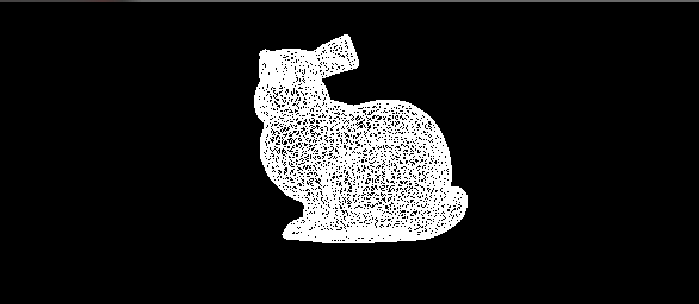
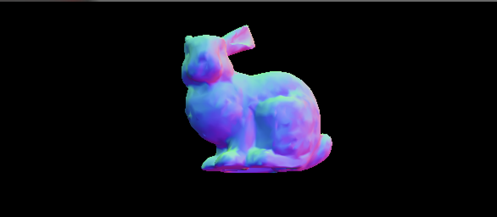

# Mesh Loader

This is a Mesh Loader (C++ based application) designed to load and visualize 3D objects. It utilizes modern OpenGL and SDL2 to render the mesh on the screen. It provides wired and shaded mode.





## Features

1. **OpenGL Integration**: Uses modern OpenGL for rendering.
2. **Shader Support**: Dynamic shader loading and compiling.
3. **Object Loading**: Support for loading 3D objects from `.obj` files.
4. **Interactivity**: Real-time interactions such as translation, rotation, and toggling between wireframe and filled view.
5. **Custom Mesh Object Handling**: Dedicated `Object` class for managing 3D objects.

## Getting Started

### Prerequisites

1. Ensure you have OpenGL and SDL2 installed.
2. The GLM library is used for matrix operations and transformations.

### Compilation

To build the project, simply run the `build.py` script:

```bash
python build.py
This will compile the project into an executable.
```

### Usage

1. Run the compiled application:

```bash
./MeshLoader
```

2. Interactions:

- **Arrow Up/Down**: Translate the object.
- **Arrow Left/Right**: Rotate the object.
- **W**: Toggle between wireframe and filled mode.

## Code Overview

### GraphicsApp

This class is responsible for the major operations involving the graphics. Key functions include:

- `Initialize()`: Set up the necessary OpenGL configurations, load vertices, and shaders.
- `Input()`: Handle keyboard inputs.
- `Draw()`: Render the object.
- `MainLoop()`: The main application loop where input and draw functions are called.

### Object

Represents a 3D object. Key features:

- Parses `.obj` files to retrieve vertex and normal data.
- Supports different face patterns (`v/vt/vn`, `v//vn`, etc.).
  
## Future Enhancements

- **Texture Support**: Add support for textured 3D objects.
- **Lighting**: Implement basic lighting techniques for improved visualization.

## Troubleshooting

1. **Shader Not Loading**: Ensure the path to the shader files is correctly set in the `ShaderLoader` function calls.
2. **Object Not Visible**: Ensure the `.obj` file path is correctly specified. Verify the model's scale and position in the 3D space.

## Contributing

Feel free to fork this project and submit pull requests for any enhancements or bug fixes. Ensure you've tested your changes before submitting a pull request.

## License

This project is open source. You can use, modify, and distribute it as per your needs. However, any contributions you make should also be open source.

## Acknowledgements

Thanks to the OpenGL and SDL2 communities for the extensive documentation and tutorials.